<div align="center">

# 👋 Hey there! I'm **Adhilul Afhaad**


</div>

---

## 🎯 **About Me**

```typescript
const adhilul = {
    pronouns: "he/him",
    location: "🌍 Earth",
    currentFocus: ["Full Stack Development", "Cloud Architecture", "Open Source"],
    technologies: {
        backend: ["Laravel", "PHP", "Python"],
        frontend: ["JavaScript", "TypeScript", "Livewire"],
        mobile: ["Flutter", "Dart"],
        cloud: ["AWS", "Firebase"],
        databases: ["MySQL", "PostgreSQL", "MongoDB"],
        tools: ["Docker", "Git", "VS Code"]
    },
    currentlyLearning: ["Kubernetes", "Microservices", "AI/ML"],
    funFact: "I debug with console.log() and I'm not ashamed! 😄"
};
```

---

## 🛠️ **Tech Arsenal**

<div align="center">

### **Languages & Frameworks**


### **Frontend & Mobile**


### **Cloud & Tools**


</div>

---

## 📊 **GitHub Analytics**

<div align="center">
  
  
</div>

<div align="center">
  
</div>

---

## 🏆 **GitHub Trophies**

<div align="center">
  
</div>

---

## 📈 **Contribution Graph**

<div align="center">
  
</div>

---

## 🎨 **What I'm Working On**

```mermaid
graph TD
    A[💡 Ideas] --> B[🛠️ Development]
    B --> C[🧪 Testing]
    C --> D[🚀 Deployment]
    D --> E[📊 Monitoring]
    E --> F[🔄 Iteration]
    F --> A
    
    style A fill:#6C63FF,stroke:#333,stroke-width:2px,color:#fff
    style B fill:#FF6B6B,stroke:#333,stroke-width:2px,color:#fff
    style C fill:#4ECDC4,stroke:#333,stroke-width:2px,color:#fff
    style D fill:#45B7D1,stroke:#333,stroke-width:2px,color:#fff
    style E fill:#96CEB4,stroke:#333,stroke-width:2px,color:#fff
    style F fill:#FFEAA7,stroke:#333,stroke-width:2px,color:#000
```

<div align="center">



</div>

---

## 🤝 **Let's Connect & Collaborate**

<div align="center">

[](https://linkedin.com/in/adhilulafhaad)
[](https://twitter.com/yourusername)
[](https://dev.to/yourusername)
[](https://github.com/adhilafhaad)
[](https://yourportfolio.com)

</div>

---

## 💫 **Fun Zone**

<div align="center">

### 🎵 **Coding Playlist Mood**


### ☕ **Coffee Level**


### 🌟 **Quote of the Day**
*"Code is like humor. When you have to explain it, it's bad."* – Cory House


</div>

---

<div align="center">

### 👀 **Profile Views**


### 💝 **Support My Work**
[](https://buymeacoffee.com/adhilafhaad)

**⭐ Star my repositories if you find them helpful!**


</div>
